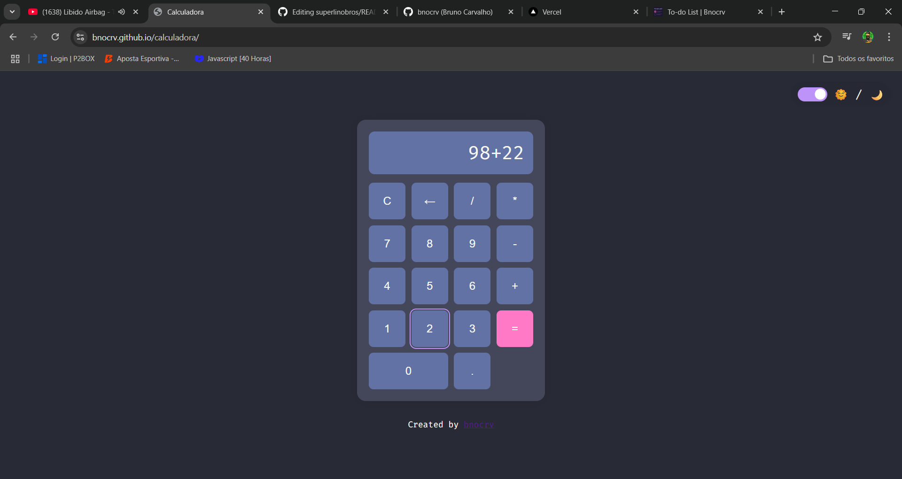

# 🧮 Calculadora

Calculadora simples desenvolvida com **HTML**, **CSS** e **JavaScript puro**, com tema visual baseado na paleta de cores **Dracula**. O objetivo deste projeto foi reforçar conceitos de manipulação de DOM, eventos de teclado e click, além de boas práticas no uso de funções e controle de estados.

[🔗 Acesse o projeto](https://bnocrv.github.io/calculadora)

---

---

# 🧩 Funcionalidades principais

- Operações básicas: **adição, subtração, multiplicação e divisão**
- Teclado funcional: suporte a cliques e teclas do teclado físico
- Botão "C" para limpar a conta atual
- Botão "⌫" para apagar o último dígito inserido
- Estilo visual escuro com **paleta Dracula**
- Responsiva e adaptada para dispositivos móveis

---

# 📷 Screenshot

---

# 🧠 Conceitos e tecnologias aplicadas

- HTML5 semântico para estrutura da calculadora
- CSS3 com layout flexível e responsivo
- JavaScript (vanilla) para lógica e controle das operações
- Manipulação de eventos de clique e teclado (`keydown`)
- Tratamento de erros e entrada inválida
- Projeto com foco em UX e clareza visual

---

# 🧪 Melhorias futuras

- Suporte a operações com parênteses e precedência
- Histórico de operações recentes
- Teclado virtual animado
- Tema claro (alternável)
- Adição de som ao pressionar teclas (opcional)

---

# 👨‍💻 Sobre

Esse projeto foi criado como parte dos meus estudos em **Análise e Desenvolvimento de Sistemas (ADS)**, com o foco em consolidar a lógica de programação, tratamento de eventos e estruturação de interfaces simples, mas funcionais.

---

## 📫 Contato

- GitHub: [@bnocrv](https://github.com/bnocrv)  
- LinkedIn: [@bnocrv](https://linkedin.com/in/bnocrv)
